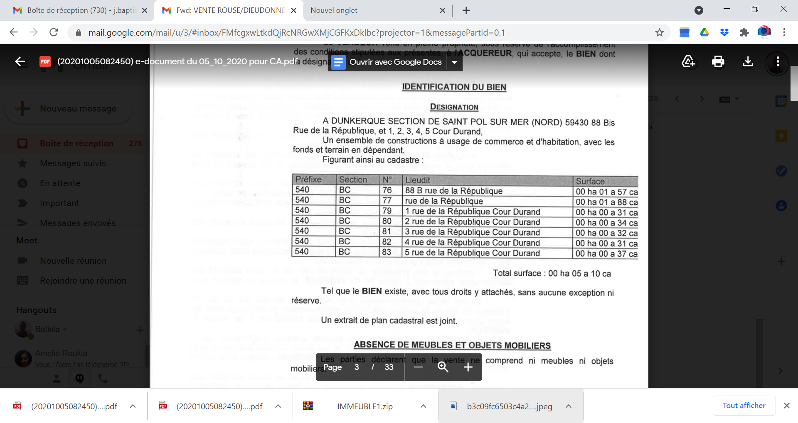

# group01
# Apprendre les titres
# Gros titre
## Titre moyen
### Petit titre

# Style de texte
texte simple bonjour ça va toi  
**Ceci est un texte gras**
Nous avons  __un texte__ qui à la fois en gras et simple  
*Texte en italique*  
Mon texte est plus petit  

SuperScript

#Citations
>Nous avons ici une citation
Nous avons imbriqué 'une citation' ici  

#code distinct  
Pour faire un commit  
git status
git add
git commit -m "nom du commit"

# Lien URL
Pour aller sur le site:[i love PDF](https://www.ilovepdf.com/fr)  
Lien vers un autre fichier []  

# Ajouter une image

# Ajouter un emoji
Pour trouver la liste des emojis disponible avec GitHub : [Liste des emojis](https://github.com/ikatyang/emoji-cheat-sheet)

## Liste simple
* Element A
* Element B
* Element C     

## Liste ordonnées
1. Carottes
2. Beurre
3. Pomme de terre

## Liste imbriquée
* Element 1
  * Element 1.A
    * Element 1.A.a  
  

## ToDo
* [ ]Roquefort
* [x]Cantal
* [ ]Emmental

  

